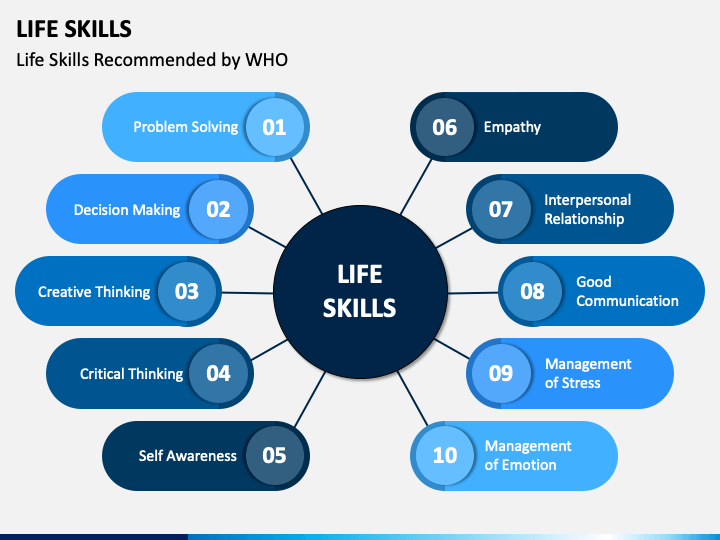

# life-skills-track
1. Life skills are a set of abilities and competencies that help persons to manage their personal and professional lives effectively.
2. They are essential for building confidence, and independence for ensuring personal and social success in all areas of life.
#### Here we will practice and learn some essential life skills.
* Problem-solving
* Decision making
* Creative thinking
* Critical thinking
* Self-awareness
* Empathy
* Interpersonal skills
* Good communication
* Management of time and stress
* Adaptability
* Responsibility

