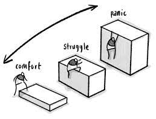

# Grit and growth mindset

## Question 1.
Paraphrase (summarize) the video in a few lines. Use your own words.
***
1. That video contains the story of a lady who was a teacher at an early age. At that time she analyzed the performance of students and that some of the student's `IQ` was not that high but they perform very well and some students' `IQ` was very high they are not performing as much as expected.

2. After analyzing so many factors she saw that performance doesn't depend only on `IQ` level. Some other factors also matter.

3. To get more clarity about the learning process of our brain she goes to study psychology and studied different age groups. to know the learning process.

4. She got the conclusion that our learning process does not remain constant we can change it through our efforts.

5. If want to learn something you need to have grit. The like learning is not a sort period task you should keep patient.
***

## Question 2.
What are your key takeaways from the video to take action on?
***
1. My takeaway from the video grit is more important than other factors. If you will change your mindset your learning ability will change.

2. To learn something we should take time and keep patient.
***

## Question 3.
Paraphrase (summarize) the video in a few lines in your own words.
***

1. Carol Dwecks studying for decades why some people succeed and why some people are not who are equally talented. And It was discovered that it is mindset plays a crucial role in this process.

2. There are two types of mindset people have. The first one is a `Fixed mindset` and the second one is a `Growth mindset`.

3. A fixed mindset believes that abilities are born they can't be changed.

4. A growth mindset believes that abilities are built it can be changed.

5. According to Lebron James, a growth mindset thinks about growth. They think that we can do better.

6. The video was making a very clear difference between a growth mindset and a fixed mindset.

7. The growth mindset takes action by making mistakes and taking challenges as an opportunity to get feedback and appreciate it. A growth mindset focuses on learning not the result.

8. A fixed mindset takes focus on the result, not on the learning. They hate challenges and avoid them. try to be comfortable and never worry about feedback.
***

## Question 4.
What are your key takeaways from the video to take action on?
***

1. By making efforts we can change our learning abilities and grow.

2. Focus on learning not on goal or result.
   
3. Challenges are actually an opportunity to learn something new.

4. Feedback and growth mindset
***

## Question 5.
What is the Internal Locus of Control? What is the key point in the video?
***

1. According to the research, there are 3 types of people the first they believe that their abilities are god gifted. And the second one is a hard-working mindset. the third category is lie between lazy mindset.

2. The people who believe that they are god gifted only focus on easy tasks or repetitive tasks and when they failed they get frustrated and demotivated. Their locus of control is outside.

3. The people who believe that they are hard workers and they enjoy the process of challenges and try more and more effort. This type of mindset is always trying something new tasks and they enjoy either they fail or completing them. they control them from the inside and always stay motivated.

4. The key point is the locus of control. if your locus of control is inside you you will stay motivated.
***

## Question 6.
Paraphrase (summarize) the video in a few lines in your own words.
***

1. According to my observations, this video explains the aceptance mindset. And unacceptance of mindset. If you think that what is going on you can't control what is going on in your life then really no change will happen.

2. If you analyze that you can do better or you can improve then by making effort you will do that.

3. If you will not take action you can't grow. if you think that you are the person you are you can't change so this is a fixed mindset.
***

## Question 7.
What are your key takeaways from the video to take action on?
***

>Nothing is fixed if some challenges come in life or anywhere in our daily tasks or job try to make some effort and enjoy the process and always have a focused mindset. Our abilities can be changed by hard work and efforts.

***

## Question 8.
What are one or more points that you want to take action on from the manual?
***

### I want to take some points below

1. I am 100 percent responsible for my learning.
2. I know more efforts lead to better understanding.
3. I will understand each concept properly.
4. I will treat new concepts and situations as learning opportunities. I will never get pressurized by any concept or situation.
5. I will stay relaxed and focused no matter what happens.
6. I will use the weapons of Documentation, Google, Stack Overflow, Github Issues and the Internet before asking for help from fellow warriors or looking at the solution.
7. I will take ownership of the projects assigned to me. Its execution, delivery and functionality are my sole responsibility.
8. I am very good friends with Confusion, Discomfort and Errors.
9. Confusion tells me there is more understanding to be achieved.
10. Discomfort tells me I have to make an effort to understand. I understand the learning process is uncomfortable.
11. Errors tell me what is not working in my code and how to fix it.
12. I will understand the users very well. I will serve them and society by writing rock-solid excellent software.
13. I will be focused on mastery till I can do things half asleep. If someone wakes me up at 3 AM in the night, I will calmly solve the problem like James Bond and go to sleep. 
14. I will not leave my code unfinished till I complete the following checklist:
         1. Make it work.
         2. Make it readable.
         3. Make it modular.
        4. Make it efficient.
15. I will follow the steps required to solve problems:
Relax
16. Focus - What is the problem? What do I need to know to solve it?

